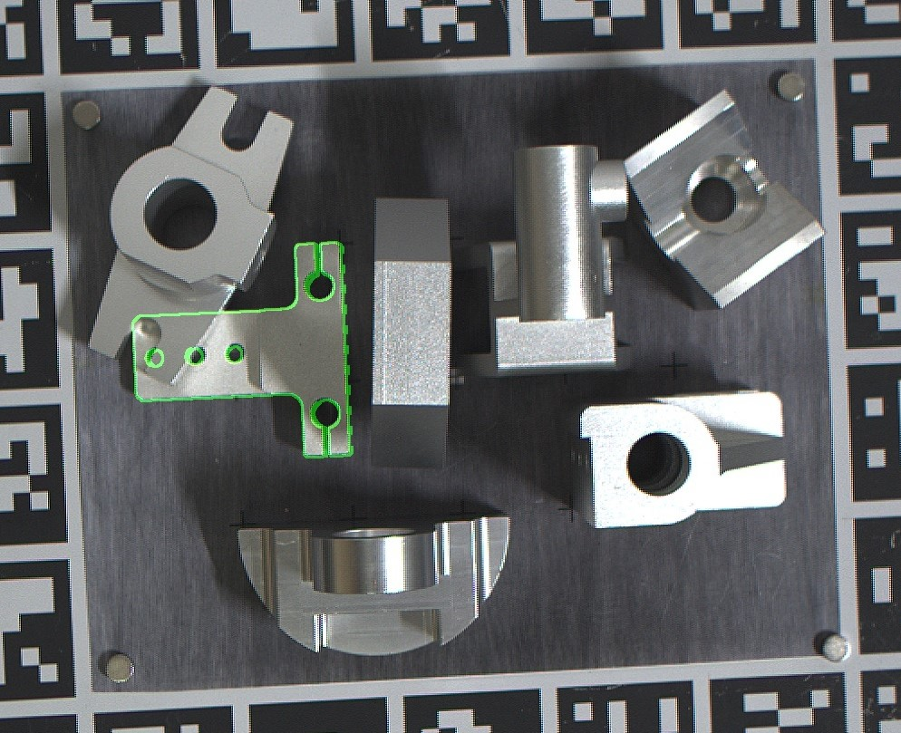

# G-GOP
G-GOP is a new **feature-to-image** pose estimation method so as to deal with the discrete template substitution error (DTS error) and the center approximation substitution error (CAS error).

## Video


You can download the relevant data to generate the above video [here](https://1drv.ms/u/s!AiwRMXEmaB9wjApqumpIToF_dcCD?e=FfvNiG), and then use the main.py of scipt_for_video to generate the above video.

## Installation

1. Set up the python environment:

   ```
   conda create -n G-GOP python=3.7
   conda activate G-GOP
   ```

   ### install other requirements

   ```
   pip install -r requirements.txt
   ```

## Training

Before training and testing, you need to modify config.py to specify the train_data_root and test_data_root.
   run

   ```
python main.py --train True
   ```

## Testing

run

```
python main.py --scene_dir_name your_scene_dir_name
```

## Demo

You can download the pretrained model and some test data [here](https://1drv.ms/u/s!AiwRMXEmaB9wjAlwKTTUZCs_iJ9o?e=iAjg3d)

You can get the image overlaied as shown below:


